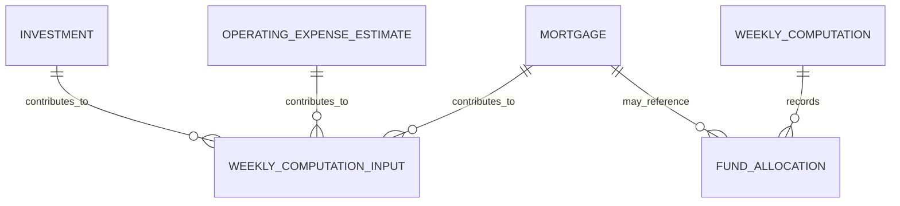

# 04. Domain and Data Analysis

## 1. Domain Glossary

| Term | Definition |
|---|---|
| MSG Foundation | Martha Stockton Greengage 유산으로 설립되는 주택 지원 재단. |
| Mortgage | 부동산을 담보로 하는 주택 대출. |
| 100% Mortgage | MSG Foundation이 주택 가격 전액을 지원하는 모기지. |
| Principal | 차용 원금. |
| Interest | 대출 잔액에 대해 발생하는 이자. |
| P&I | Principal and Interest. 원금과 이자를 포함한 정기 지불액. |
| Escrow | 세금/보험 납부를 위해 관리되는 적립 계좌 개념. |
| Real-estate Tax | 주택에 대한 연간 부동산세. |
| Homeowner’s Insurance Premium | 주택 소유자 연간 보험료. |
| Grant | 부부의 소득 28% 한도를 초과하는 모기지 비용을 재단이 보조하는 금액. |
| Weekly Funds Computation | 매주 사용 가능한 주택 구매 자금을 계산하는 프로세스. |
| Amount Available | 주 시작 시 신규 주택 구매에 사용할 수 있는 금액. 산식은 `weekly investment income - weekly operating expenses + expected mortgage repayments - expected grants`로 결정됨. |
| Mortgagees | 모기지를 받은 고객/부부. |
| Closing Costs | 주택 거래 종료 시 발생하는 법률 비용, 세금 등 부대 비용. |
| Points | 대출 시 선지급되는 원금 비율 기반 비용. |

## 2. Core Domain Entities

### Investment

- 재단의 투자 항목.
- 연간 예상 수익을 제공한다.
- 주간 자금 계산의 수입 쪽 입력이다.

### OperatingExpenseEstimate

- 재단의 연간 예상 운영 비용.
- 주간 자금 계산의 비용 쪽 입력이다.
- 단일 전역 값인지 기간별 레코드인지는 설계에서 기간별 레코드로 모델링한다.

### Mortgage

- 승인된 재단 모기지 계정.
- 주간 P&I, 소득, 세금, 보험료를 기반으로 고객 부담액과 보조금을 계산한다.

### WeeklyComputation

- 특정 주의 자금 계산 결과.
- 입력 snapshot과 결과를 보존하여 보고서와 감사에 사용한다.

### FundAllocation

- 특정 주에 신규 주택 구매를 위해 가용 자금을 차감한 기록.
- 파일럿에서는 신청 전체 심사보다 “자금이 있는지” 판단하는 행위에 초점을 둔다.

## 3. Conceptual Model



## 4. 비즈니스 규칙

| ID | 규칙 | 비고 |
|---|---|---|
| BR-001 | 주간 투자 수입은 연간 투자 수익을 52로 나눈 값이며, 저장/표시 값은 센트 단위로 반올림한다. | 모든 투자 항목을 합산한다. |
| BR-002 | 주간 운영 비용은 연간 운영 비용을 52로 나눈 값이며, 저장/표시 값은 센트 단위로 반올림한다. | 활성/최신 추정치를 사용한다. |
| BR-003 | 주간 에스크로 지불액은 연간 부동산세와 연간 보험료의 합을 52로 나눈 값이다. | 세금/보험료는 원천 필드로 분리 보존하되, 주간 계산에서는 합산한다. |
| BR-004 | 총 주간 모기지 비용은 주간 원리금(P&I)과 주간 에스크로 지불액의 합이다. | 모기지별로 계산한다. |
| BR-005 | 부부 부담 가능 한도는 현재 합산 주간 총소득의 28%이다. | 모기지별로 계산한다. |
| BR-006 | 주간 보조금은 총 주간 모기지 비용이 부담 가능 한도를 초과하는 양수 차액이다. | 음수가 될 수 없다. |
| BR-007 | 예상 모기지 상환액은 활성 모기지별 예상 수혜자 주간 상환액의 합이다. | Q-008 확정. 모기지별 예상 수혜자 주간 상환액 = `total weekly mortgage cost - weekly grant = min(total weekly mortgage cost, affordability cap)`. |
| BR-008 | 시작 가용 금액 = `weekly investment income - weekly operating expenses + expected mortgage repayments - expected grants`이다. | Q-001 확정. |
| BR-009 | 주택 비용이 잔여 주간 가용 금액 이하이면 해당 주택 구매 자금 지원이 가능하다. | 파일럿 수준의 자금 지원 가능성 판단이다. |
| BR-010 | 주택 구매 자금 지원이 이루어지면 잔여 주간 가용 금액은 주택 비용만큼 감소한다. | 해당 주 안에서 적용한다. |
| BR-011 | 주 시작일은 첫 영업일이고 주 종료일은 마지막 영업일이다. 공휴일과 재단 휴업일은 제외한다. | Q-007 확정. |

## 5. Mortgage Calculation Example Shape

For each mortgage:

```text
weekly_escrow = (annual_real_estate_tax + annual_homeowner_insurance_premium) / 52
total_weekly_mortgage_cost = weekly_principal_and_interest + weekly_escrow
affordability_cap = current_combined_gross_weekly_income * 0.28
weekly_grant = max(0, total_weekly_mortgage_cost - affordability_cap)
expected_beneficiary_weekly_repayment = total_weekly_mortgage_cost - weekly_grant
expected_beneficiary_weekly_repayment = min(total_weekly_mortgage_cost, affordability_cap)
```

## 6. State Model

### Mortgage State

| State | Meaning | Allowed Transitions |
|---|---|---|
| Draft | 데이터 입력 중 | Active, Cancelled |
| Active | 주간 계산에 포함 | Closed, Suspended |
| Suspended | 일시적으로 계산 제외 가능 | Active, Closed |
| Closed | 종료된 모기지 | None |
| Cancelled | 잘못 생성되어 사용하지 않음 | None |

### Weekly Computation State

| State | Meaning | Allowed Transitions |
|---|---|---|
| Draft | 계산 실행 전/검토 중 | Finalized, Cancelled |
| Finalized | 보고서로 사용할 계산 결과 확정 | Archived |
| Archived | 과거 기록 | None |
| Cancelled | 오류로 폐기 | None |

## 7. Invariants

- 금액 필드는 음수가 될 수 없다. 단, 조정/보정 레코드가 필요하면 별도 타입으로 정의한다.
- Mortgage account number는 고유해야 한다.
- Investment item number는 고유해야 한다.
- Weekly computation은 week start date 기준으로 식별된다.
- 같은 주의 finalized computation은 하나만 유지하는 것이 기본이다.
- 계산에 사용된 값은 이후 입력 데이터가 바뀌더라도 audit을 위해 snapshot으로 보존해야 한다.

## 8. Decision Status and Open Issues

| ID | Topic | Status | Notes |
|---|---|---|---|
| Q-001 | 주간 가용 자금 산식 | Resolved | `weekly investment income - weekly operating expenses + expected mortgage repayments - expected grants`. |
| Q-002 | 90% 모기지 조건 처리 | Resolved — Out of Pilot | 자격 심사 비교 조건은 시스템 밖에서 오프라인 수동 판단. |
| Q-003 | 신청/수혜자 자격 심사 범위 | Resolved — Out of Pilot | 파일럿 시스템은 투자/운영비/모기지 데이터 기반 주간 자금 계산만 담당. |
| Q-004 / Q-009 | 구현 플랫폼과 보고서 출력 매체 | Developer Decision | CLI/Web/Desktop 및 출력 방식은 개발자가 선택. |
| Q-005 | 데이터 입력 담당자와 권한 모델 | Developer Decision | 단순 관리자/승인 운영 담당자 입력 모델. 전체 변경 이력 대신 `Date last updated` 유지. |
| Q-006 | 금액 반올림 규칙 | Developer Decision | decimal/fixed-point 계산, 저장/표시는 센트 단위 반올림. |
| Q-007 | 매주 초/말 기준일 | Resolved by Project Decision | 공휴일/재단 휴업일을 제외한 첫/마지막 영업일. |
| Q-008 | “총 예상 모기지 상환액”의 합산 범위 | Resolved by User Decision | 활성 mortgage별 수혜자 실제 예상 주간 상환액의 합으로 계산한다. |
| Q-010 | 필수 산출물 범위 | Resolved | 분석/설계 문서가 필수이며 구현은 선택 사항. |

현재 남아 있는 핵심 도메인 미확정 이슈는 없다. Use Case, SSD, Operation Contract, Class Diagram, 설계 Sequence Diagram은 Q-008 확정 정의를 동일하게 사용한다.
