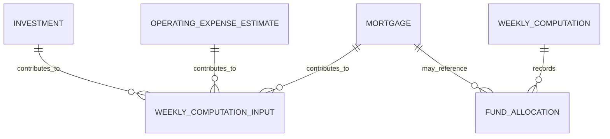

# 04. Domain and Data Analysis

## 1. Domain Glossary

| Term | Definition |
|---|---|
| MSG Foundation | Martha Stockton Greengage 유산으로 설립되는 주택 지원 재단. |
| Mortgage | 부동산을 담보로 하는 주택 대출. |
| 100% Mortgage | MSG Foundation이 주택 가격 전액을 지원하는 모기지. |
| Principal | 차용 원금. |
| Interest | 대출 잔액에 대해 발생하는 이자. |
| P&I | Principal and Interest. 원금과 이자를 포함한 정기 지불액. |
| Escrow | 세금/보험 납부를 위해 관리되는 적립 계좌 개념. |
| Real-estate Tax | 주택에 대한 연간 부동산세. |
| Homeowner’s Insurance Premium | 주택 소유자 연간 보험료. |
| Grant | 부부의 소득 28% 한도를 초과하는 모기지 비용을 재단이 보조하는 금액. |
| Weekly Funds Computation | 매주 사용 가능한 주택 구매 자금을 계산하는 프로세스. |
| Amount Available | 주 시작 시 신규 주택 구매에 사용할 수 있는 금액. 정확한 산식은 검증 필요. |
| Mortgagees | 모기지를 받은 고객/부부. |
| Closing Costs | 주택 거래 종료 시 발생하는 법률 비용, 세금 등 부대 비용. |
| Points | 대출 시 선지급되는 원금 비율 기반 비용. |

## 2. Core Domain Entities

### Investment

- 재단의 투자 항목.
- 연간 예상 수익을 제공한다.
- 주간 자금 계산의 수입 쪽 입력이다.

### OperatingExpenseEstimate

- 재단의 연간 예상 운영 비용.
- 주간 자금 계산의 비용 쪽 입력이다.
- 단일 전역 값인지 기간별 레코드인지는 설계에서 기간별 레코드로 모델링한다.

### Mortgage

- 승인된 재단 모기지 계정.
- 주간 P&I, 소득, 세금, 보험료를 기반으로 고객 부담액과 보조금을 계산한다.

### WeeklyComputation

- 특정 주의 자금 계산 결과.
- 입력 snapshot과 결과를 보존하여 보고서와 감사에 사용한다.

### FundAllocation

- 특정 주에 신규 주택 구매를 위해 가용 자금을 차감한 기록.
- 파일럿에서는 신청 전체 심사보다 “자금이 있는지” 판단하는 행위에 초점을 둔다.

## 3. Conceptual Model



## 4. Business Rules

| ID | Rule | Notes |
|---|---|---|
| BR-001 | Weekly investment income is annual investment return divided by 52. | Sum across investments. |
| BR-002 | Weekly operating expense is annual operating expense divided by 52. | Use active/latest estimate. |
| BR-003 | Weekly escrow is annual real-estate tax plus annual insurance premium divided by 52. | Per mortgage. |
| BR-004 | Total weekly mortgage cost is weekly P&I plus weekly escrow. | Per mortgage. |
| BR-005 | Couple affordability cap is 28% of current combined gross weekly income. | Per mortgage. |
| BR-006 | Weekly grant is the positive difference between total weekly mortgage cost and affordability cap. | Never negative. |
| BR-007 | A home purchase can be funded if its cost is not greater than remaining weekly available amount. | Pilot-level fundability. |
| BR-008 | Funding a home purchase reduces remaining weekly available amount by the home cost. | During that week. |

## 5. Mortgage Calculation Example Shape

For each mortgage:

```text
weekly_escrow = (annual_real_estate_tax + annual_homeowner_insurance_premium) / 52
total_weekly_mortgage_cost = weekly_principal_and_interest + weekly_escrow
affordability_cap = current_combined_gross_weekly_income * 0.28
weekly_grant = max(0, total_weekly_mortgage_cost - affordability_cap)
customer_weekly_payment = total_weekly_mortgage_cost - weekly_grant
```

## 6. State Model

### Mortgage State

| State | Meaning | Allowed Transitions |
|---|---|---|
| Draft | 데이터 입력 중 | Active, Cancelled |
| Active | 주간 계산에 포함 | Closed, Suspended |
| Suspended | 일시적으로 계산 제외 가능 | Active, Closed |
| Closed | 종료된 모기지 | None |
| Cancelled | 잘못 생성되어 사용하지 않음 | None |

### Weekly Computation State

| State | Meaning | Allowed Transitions |
|---|---|---|
| Draft | 계산 실행 전/검토 중 | Finalized, Cancelled |
| Finalized | 보고서로 사용할 계산 결과 확정 | Archived |
| Archived | 과거 기록 | None |
| Cancelled | 오류로 폐기 | None |

## 7. Invariants

- 금액 필드는 음수가 될 수 없다. 단, 조정/보정 레코드가 필요하면 별도 타입으로 정의한다.
- Mortgage account number는 고유해야 한다.
- Investment item number는 고유해야 한다.
- Weekly computation은 week start date 기준으로 식별된다.
- 같은 주의 finalized computation은 하나만 유지하는 것이 기본이다.
- 계산에 사용된 값은 이후 입력 데이터가 바뀌더라도 audit을 위해 snapshot으로 보존해야 한다.

## 8. Open Issues

- 주간 가용 자금 산식 확정 필요.
- 90% 모기지 조건과 100% 재단 모기지의 관계 확정 필요.
- 신청 심사 데이터가 파일럿에 포함되는지 확정 필요.
