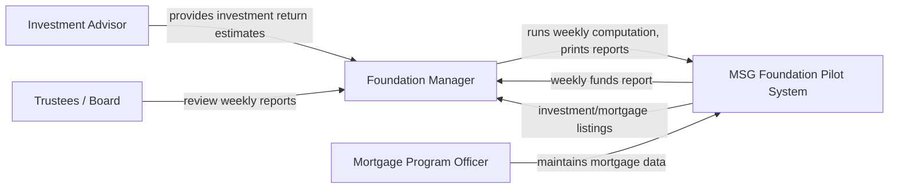
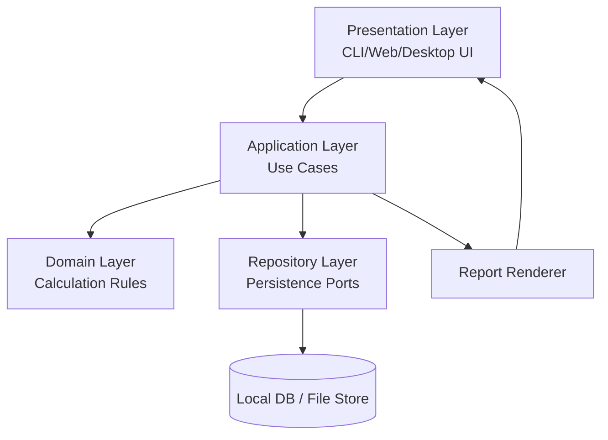
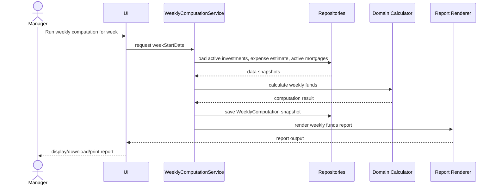

# 06. Architecture Design

## 1. Architecture Goals

MSG Foundation 파일럿 시스템의 아키텍처 목표는 다음과 같다.

1. 주간 자금 계산을 정확하고 추적 가능하게 수행한다.
2. 투자/운영비/모기지 데이터만 다루는 작은 파일럿 범위를 유지한다.
3. 컴퓨터 경험이 적은 사용자도 보고서를 쉽게 얻을 수 있게 한다.
4. 향후 신청 심사, 문서 관리, 외부 연동으로 확장 가능하게 한다.
5. 구현 단계에서 CLI, Web, Desktop 중 하나를 선택해도 핵심 도메인/계산 로직을 재사용할 수 있게 한다.

## 2. Recommended Architecture Style

**Modular Monolith with Layered Architecture**를 권장한다.

파일럿 프로젝트는 데이터 범위가 작고 외부 연동이 없으므로 마이크로서비스나 복잡한 분산 구조는 과하다. 대신 계산 로직을 독립적인 domain/application layer로 분리하여 향후 UI나 저장소를 교체할 수 있게 한다.

## 3. System Context



## 4. Container View



## 5. Component Responsibilities

| Component | Responsibility |
|---|---|
| Presentation Layer | 사용자 입력, 메뉴/화면, 보고서 요청, 결과 표시 |
| Application Layer | use case orchestration, transaction boundary, authorization checks |
| Domain Layer | 모기지 비용, 보조금, 주간 자금 계산 규칙 |
| Repository Layer | Investment, OperatingExpense, Mortgage, WeeklyComputation 저장/조회 |
| Report Renderer | 주간 결산서, 투자 목록, 모기지 목록 출력 |
| Audit Logger | 데이터 변경과 계산 실행 이력 기록 |

## 6. Main Use Cases

| Use Case | Application Service | Domain Service |
|---|---|---|
| Manage investments | InvestmentService | n/a |
| Manage operating expense estimate | OperatingExpenseService | n/a |
| Manage mortgages | MortgageService | MortgageCalculation |
| Run weekly funds computation | WeeklyComputationService | FundsAvailabilityCalculation |
| Check home fundability | FundingService | FundabilityRule |
| Generate reports | ReportService | ReportViewModels |

## 7. Dependency Direction

```text
Presentation -> Application -> Domain
Application -> Repository Port <- Repository Adapter
Application -> Report Port <- Report Adapter
```

Domain layer must not depend on UI, database, file system, or framework code.

## 8. Data Flow — Weekly Computation



## 9. Architecture Decisions

### ADR-001. Use Modular Monolith for Pilot

- **Decision:** 설계는 modular monolith를 기준으로 한다.
- **Alternatives:** spreadsheet-only, microservices, external workflow platform.
- **Rationale:** 파일럿 범위가 작고 비용 제약이 강하다. 계산 로직을 분리하면 단순성과 확장성을 동시에 확보할 수 있다.
- **Trade-off:** 초기에는 단일 배포 단위지만, 향후 규모가 커지면 모듈 경계를 기준으로 분리 가능하다.

### ADR-002. Keep Calculation Logic in Domain Layer

- **Decision:** 금액/보조금/자금 계산은 UI나 DB 쿼리에 두지 않고 domain service에 둔다.
- **Rationale:** 계산 정확성과 테스트 용이성이 핵심이다.
- **Trade-off:** 단순 CRUD보다 설계가 조금 복잡하지만 장기 유지보수에 유리하다.

### ADR-003. Store Computation Snapshots

- **Decision:** WeeklyComputation 실행 시 입력값 snapshot과 결과를 저장한다.
- **Rationale:** 이후 투자/소득/세금 데이터가 바뀌어도 과거 보고서 재현이 가능해야 한다.
- **Trade-off:** 저장 데이터가 중복되지만 감사 가능성이 높아진다.

## 10. Extension Points

- Eligibility screening module
- Applicant document management
- External median home price source
- Bank/payment integration
- PDF/CSV report export
- Multi-user web deployment

## 11. Architecture Risks

| Risk | Mitigation |
|---|---|
| Core formula ambiguity | Keep formula isolated and testable; document formula version. |
| Overbuilding pilot | Defer eligibility and external integrations. |
| Inexperienced users | Prefer report-first UI and simple navigation. |
