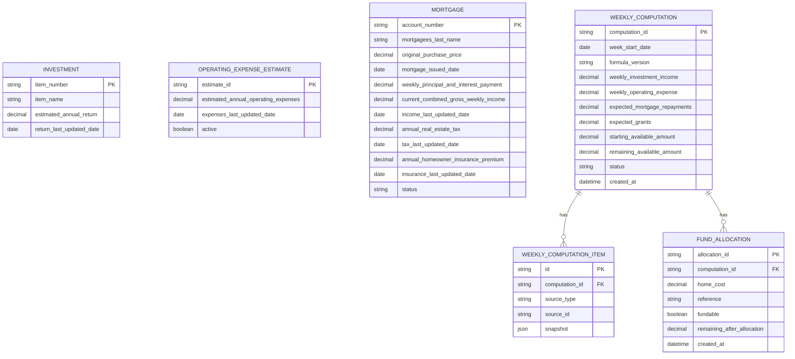

# 08. Data Model and Schema Design

## 1. Logical Data Model

## 2. Physical Schema Draft

> SQL dialect is intentionally generic. Implementation may adapt to SQLite, PostgreSQL, MySQL, or another store.

### `investments`

| Column | Type | Constraints |
|---|---|---|
| item_number | varchar | PK, not null |
| item_name | varchar | not null |
| estimated_annual_return | decimal(14,2) | not null, >= 0 |
| return_last_updated_date | date | not null |

### `operating_expense_estimates`

| Column | Type | Constraints |
|---|---|---|
| estimate_id | varchar | PK |
| estimated_annual_operating_expenses | decimal(14,2) | not null, >= 0 |
| expenses_last_updated_date | date | not null |
| active | boolean | not null |
| created_at | datetime | not null |

### `mortgages`

| Column | Type | Constraints |
|---|---|---|
| account_number | varchar | PK |
| mortgagees_last_name | varchar | not null |
| original_purchase_price | decimal(14,2) | not null, >= 0 |
| mortgage_issued_date | date | not null |
| weekly_principal_and_interest_payment | decimal(14,2) | not null, >= 0 |
| current_combined_gross_weekly_income | decimal(14,2) | not null, >= 0 |
| income_last_updated_date | date | not null |
| annual_real_estate_tax | decimal(14,2) | not null, >= 0 |
| tax_last_updated_date | date | not null |
| annual_homeowner_insurance_premium | decimal(14,2) | not null, >= 0 |
| insurance_last_updated_date | date | not null |
| status | varchar | not null, enum-like: DRAFT/ACTIVE/SUSPENDED/CLOSED/CANCELLED |

### `weekly_computations`

| Column | Type | Constraints |
|---|---|---|
| computation_id | varchar | PK |
| week_start_date | date | not null, unique for finalized computation |
| formula_version | varchar | not null |
| weekly_investment_income | decimal(14,2) | not null |
| weekly_operating_expense | decimal(14,2) | not null |
| expected_mortgage_repayments | decimal(14,2) | not null |
| expected_grants | decimal(14,2) | not null |
| starting_available_amount | decimal(14,2) | not null |
| remaining_available_amount | decimal(14,2) | not null |
| status | varchar | not null |
| created_at | datetime | not null |

### `weekly_computation_items`

Stores calculation input snapshots.

| Column | Type | Constraints |
|---|---|---|
| id | varchar | PK |
| computation_id | varchar | FK weekly_computations.computation_id |
| source_type | varchar | INVESTMENT / OPERATING_EXPENSE / MORTGAGE |
| source_id | varchar | original resource id |
| snapshot_json | text/json | not null |

### `fund_allocations`

| Column | Type | Constraints |
|---|---|---|
| allocation_id | varchar | PK |
| computation_id | varchar | FK weekly_computations.computation_id |
| home_cost | decimal(14,2) | not null, >= 0 |
| reference | varchar | nullable |
| fundable | boolean | not null |
| remaining_after_allocation | decimal(14,2) | not null |
| created_at | datetime | not null |

## 3. Indexes

| Table | Index | Purpose |
|---|---|---|
| investments | PK item_number | unique lookup |
| mortgages | PK account_number | unique lookup |
| mortgages | status | active mortgage filtering |
| weekly_computations | week_start_date | weekly lookup |
| fund_allocations | computation_id | report allocations by week |

## 4. Data Validation Rules

- All amount fields must be non-negative decimal values.
- Dates cannot be null.
- `return_last_updated_date`, `expenses_last_updated_date`, `income_last_updated_date`, `tax_last_updated_date`, `insurance_last_updated_date` must be visible in reports.
- Mortgage status must be one of the defined state values.
- Active operating expense estimate should be unique.

## 5. Migration Plan Draft

Because no existing system is confirmed, the initial migration is schema creation only.

1. Create investments table.
2. Create operating expense estimates table.
3. Create mortgages table.
4. Create weekly computations table.
5. Create weekly computation items table.
6. Create fund allocations table.
7. Add indexes and constraints.
8. Seed optional sample data only if required by course evaluation.

Rollback: drop tables in reverse dependency order.

## 6. Data Retention and Privacy

- Mortgage income and names are sensitive and should be access-controlled.
- Weekly computation snapshots should be retained for audit unless policy says otherwise.
- The pilot does not store tax return files or pay stub files unless scope changes.
- If applicant document storage is added later, retention and deletion policies must be redesigned.
