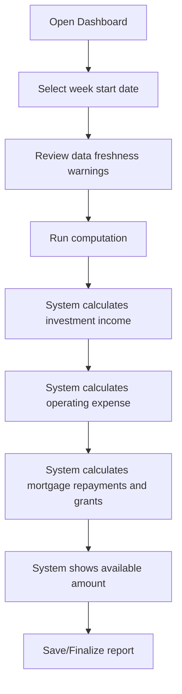

# 09. UX/UI and Report Specification

## 1. UX Principles

- Report-first: primary user goal is to obtain trustworthy weekly calculations and listings.
- Minimal navigation: file pilot should avoid complex workflows.
- Data freshness visibility: every report should show last updated dates for inputs.
- Explicit warnings: unresolved items such as expected mortgage repayment scope should be displayed until confirmed.

## 2. Information Architecture

```text
Home / Dashboard
├── Run Weekly Funds Computation
├── Reports
│   ├── Weekly Funds Computation Report
│   ├── Investment Listing
│   └── Mortgage Listing
├── Data Management
│   ├── Investments
│   ├── Operating Expense Estimate
│   └── Mortgages
└── Administration
    ├── Users and Roles
    └── Audit Log
```

## 3. Core Screens

| Screen | Purpose | Inputs | Outputs |
|---|---|---|---|
| Dashboard | Show current week and latest computation status | week start date | latest available amount, warnings |
| Weekly Computation | Run calculation | week start date, formula version | weekly funds result |
| Investment List | View/manage investments | item data | list and last updated dates |
| Operating Expense | View/manage annual estimate | annual expense, update date | current estimate |
| Mortgage List | View/manage mortgages | mortgage data | list and calculated weekly grant |
| Report Viewer | Show printable reports | report type | formatted report |

## 4. User Flow — Run Weekly Computation



## 5. Report 1 — Weekly Funds Computation Results

### Required Content

- Report title
- Week start date
- Formula version
- Generated timestamp
- Input summary:
  - total estimated annual investment return
  - weekly investment income
  - estimated annual operating expense
  - weekly operating expense
  - number of active mortgages
  - expected mortgage repayments
  - expected grants
- Result summary:
  - starting available amount
  - allocations made during week
  - remaining available amount
- Warnings:
  - formula assumptions
  - stale input data
  - missing data

Formula used:

```text
available = weekly investment income - weekly operating expenses + expected mortgage repayments - expected grants
```

Open warning to display until resolved: `expected mortgage repayments` currently uses the recommended beneficiary-paid interpretation but remains subject to final domain discussion.

### Example Layout

```text
MSG Foundation — Weekly Funds Computation
Week of: 2026-06-15
Formula: Q-001 resolved — income - expenses + repayments - grants

Investment income this week:      $100,000.00
Operating expense this week:      $ 10,000.00
Expected mortgage repayments:     $ 25,000.00
Expected grants:                  $  5,000.00
------------------------------------------------
Starting available amount:        $110,000.00
Allocated during week:            $      0.00
Remaining available amount:       $110,000.00
```

## 6. Report 2 — Listing of All Investments

Columns:

| Column | Description |
|---|---|
| Item Number | unique investment identifier |
| Item Name | investment name |
| Estimated Annual Return | latest estimated annual return |
| Last Updated | date return estimate was updated |

## 7. Report 3 — Listing of All Mortgages

Columns:

| Column | Description |
|---|---|
| Account Number | mortgage account id |
| Mortgagees Last Name | customer last name |
| Original Purchase Price | home purchase price |
| Issue Date | mortgage issue date |
| Weekly P&I | principal and interest weekly payment |
| Current Weekly Income | combined gross weekly income |
| Income Updated | income update date |
| Annual Tax | real-estate tax |
| Tax Updated | tax update date |
| Annual Insurance | homeowner insurance premium |
| Insurance Updated | insurance update date |
| Estimated Weekly Grant | calculated field |

## 8. Wireframe Sketch — Dashboard

```text
+------------------------------------------------------------+
| MSG Foundation Pilot System                                |
+------------------------------------------------------------+
| Week Start Date: [ 2026-06-15 ] [Run Weekly Computation]   |
|                                                            |
| Latest Result                                              |
|  Starting Available:  $110,000.00                          |
|  Remaining Available: $110,000.00                          |
|  Expected Grants:     $  5,000.00                          |
|                                                            |
| Warnings                                                   |
|  ! Expected mortgage repayments scope needs discussion     |
|  ! 2 mortgage income records older than 90 days            |
|                                                            |
| Reports: [Weekly Funds] [Investments] [Mortgages]          |
+------------------------------------------------------------+
```

## 9. Empty, Error, and Warning States

| State | Message | Action |
|---|---|---|
| No investments | No investment data available. | Add investment or import data. |
| No operating expense | Operating expense estimate is missing. | Add current estimate. |
| No mortgages | No active mortgages found. | Report can still run with zero mortgage totals. |
| Stale data | Some input data may be stale. | Review updated dates. |
| Repayment scope open | Expected mortgage repayments interpretation requires final confirmation. | Continue with recommended beneficiary-paid interpretation and visible warning. |

## 10. Accessibility Notes

- Use plain labels, not financial abbreviations alone.
- Always expand P&I at least once as “Principal and Interest”.
- Use high contrast warnings.
- Reports should be printable and readable without color.
