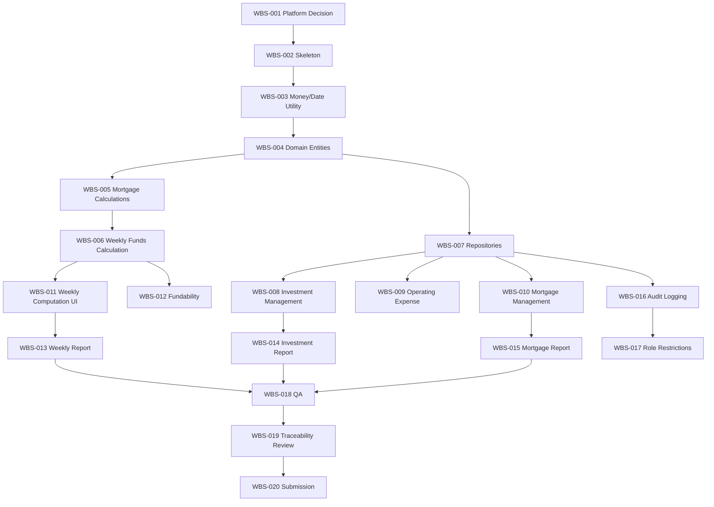

# 12. Implementation Roadmap and WBS

## 1. Purpose

이 문서는 분석/설계 산출물을 구현 단계로 넘기기 위한 작업 분해 구조(WBS)와 권장 구현 순서를 정의한다. 현재 과제에서는 구현하지 않으며, 다음 단계에서 PM → Builder → Reviewer → QA 흐름으로 사용할 수 있는 핸드오프 패킷을 제공한다.

## 2. Milestones

| Milestone | Goal | Exit Criteria |
|---|---|---|
| M1. Project Skeleton | 선택한 플랫폼의 기본 구조 준비 | repo structure, dependency setup, test runner ready |
| M2. Domain Calculation Core | 금융 계산 규칙 구현 | unit tests for BR-001~BR-008 pass |
| M3. Persistence Layer | 투자/운영비/모기지 데이터 저장 | CRUD integration tests pass |
| M4. Weekly Computation Workflow | 주간 계산 실행 및 snapshot 저장 | weekly computation tests pass |
| M5. Reports | 보고서 3종 생성 | report tests pass |
| M6. Security/Audit | 권한/감사/백업 기본 설계 구현 | access/audit tests pass |
| M7. QA and Packaging | 제출/시연 가능 상태 | acceptance checklist completed |

## 3. WBS

| ID | Task | Inputs | Outputs | Done Criteria | Suggested Role |
|---|---|---|---|---|---|
| WBS-001 | Select implementation platform | architecture docs, course constraints | platform decision ADR | decision documented | PM/Architect |
| WBS-002 | Create project skeleton | platform decision | source tree, test setup | hello test passes | Builder |
| WBS-003 | Implement money/date utility | test strategy | decimal money functions | rounding tests pass | Builder |
| WBS-004 | Implement domain entities | data model | Investment, Mortgage, etc. | entity validation tests pass | Builder |
| WBS-005 | Implement mortgage calculations | domain rules | escrow, total cost, cap, grant | TC-CALC-003~006 pass | Builder |
| WBS-006 | Implement weekly funds calculation | SRS, formula decision | weekly computation service | TC-CALC-001~009 pass or marked | Builder |
| WBS-007 | Implement repositories | data model | persistence adapters | CRUD tests pass | Builder |
| WBS-008 | Implement investment management | API contract | create/list/update investments | FR-001 tests pass | Builder |
| WBS-009 | Implement operating expense management | API contract | current estimate workflow | FR-002 tests pass | Builder |
| WBS-010 | Implement mortgage management | API contract | create/list/update mortgages | FR-003 tests pass | Builder |
| WBS-011 | Implement weekly computation UI/use case | architecture, UI spec | run computation flow | manual flow works | Builder |
| WBS-012 | Implement fundability check/allocation | API contract | fundability workflow | TC-FUND tests pass | Builder |
| WBS-013 | Implement weekly funds report | report spec | report output | TC-RPT-001 pass | Builder |
| WBS-014 | Implement investment listing report | report spec | report output | TC-RPT-002 pass | Builder |
| WBS-015 | Implement mortgage listing report | report spec | report output | TC-RPT-003 pass | Builder |
| WBS-016 | Add audit logging | security docs | audit records | audit tests pass | Builder |
| WBS-017 | Add role restrictions | security docs | authorization checks | permission tests pass | Builder |
| WBS-018 | QA scenario execution | test strategy | QA report | all acceptance scenarios checked | QA |
| WBS-019 | Review against requirements traceability | RTM | review report | no Must requirement orphaned | Reviewer |
| WBS-020 | Prepare final submission package | all artifacts | final README, demo notes | evaluator can run/review | PM |

## 4. Dependency Graph

## 5. PM → Builder → Reviewer → QA Handoff

### PM Packet

- Goal: implement MSG Foundation pilot within documented scope.
- Inputs:
  - `docs/03-requirements/software-requirements-specification.md`
  - `docs/03-requirements/requirements-traceability-matrix.md`
  - `docs/06-architecture/architecture-design.md`
- Guardrails:
  - do not implement out-of-pilot eligibility screening unless approved
  - do not use floating point for money
  - implement Q-001 formula exactly and keep Q-008 repayment-scope warning visible until resolved

### Builder Packet

- Build order: WBS-002 → WBS-003 → WBS-004 → WBS-005 → WBS-006.
- Verify each calculation with `docs/11-validation/test-strategy.md` test cases.
- Keep domain calculation independent from UI and storage.

### Reviewer Packet

- Check every Must requirement has implementation and test coverage.
- Check data model matches PDF data list.
- Check Q-001 formula is implemented exactly and Q-008 repayment-scope ambiguity is not hidden.
- Check reports include update dates and warning states.

### QA Packet

- Execute weekly computation happy path.
- Execute no-data warning path.
- Execute grant-needed and no-grant mortgage scenarios.
- Execute fundability pass and fail scenarios.
- Verify report readability for non-technical users.

## 6. Open Decisions Before Implementation

| ID | Decision | Owner | Status | Blocking? |
|---|---|---|---|---|
| DEC-001 | Implementation platform: CLI/Web/Desktop | Developer | Developer Decision | No; choose simplest report-first platform for implementation. |
| DEC-002 | Exact available amount formula | Project | Resolved | No for Q-001; Q-008 repayment scope still needs discussion. |
| DEC-003 | Rounding policy | Developer | Developer Decision | No; use decimal/fixed-point and cent rounding. |
| DEC-004 | Report output format | Developer | Developer Decision | No; print-on-request compatible text/HTML/report viewer acceptable. |
| DEC-005 | Eligibility scope | Project | Resolved — Out of Pilot | No; defer eligibility screening and 90% mortgage comparison. |
| DEC-006 | Weekly start/end date | Project | Resolved | No; use first/last business day excluding holidays/closures. |
| DEC-007 | Expected mortgage repayments scope | Domain/User | Open / Needs Discussion | Yes before final implementation accuracy. |
